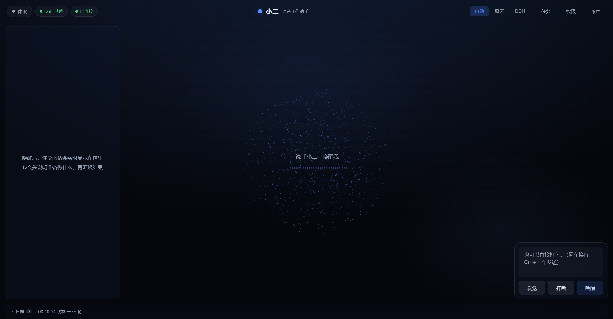

# 小二（Xiao）· Windows 语音工作助手

[English](README_EN.md) | 简体中文

一个 Windows 桌面常驻的中文语音工作助手：说「小二」唤醒 → 说话实时上屏 → 静音自动提交 → 两段式语音回复（先说明「准备干什么」，执行后再「汇报结果」）。

**本质**：给通用 Agent（DeepSeek Harness，DSH）装上语音前端，做成「语音控制的 Agent 工作台」——不只是查天气、搜网页，还能读文件、写代码、跑命令、多步迭代完成任务。语音层只负责唤醒、识别、路由，最难的部分（agent 循环、编程工具、subagent、知识库）外包给 DSH。

**核心链路**：Sherpa-ONNX 本地中文唤醒（免费、离线、零训练）→ Silero VAD 断句 → 阿里云实时流式识别（云端 qwen-audio 默认 + fun-asr 方言备选，本地可切 FunASR）→ 路由（聊天走 DeepSeek/通义千问/OpenAI/GLM/Kimi 云端，或本地 Ollama / MiniCPM-o(本地 vLLM)；干活走 DSH）→ 危险操作语音审批 → 播报（Qwen 实时流式默认，边合成边播语音紧跟字幕；可选 edge-tts 免费云、Piper 本地离线、MiniCPM-o 本地 vLLM）。

**多方案管理**：唤醒 / 识别 / 播报 / 大模型四环节均支持多方案（卡片列表 + 新建编辑 + 一键切换，模型名手填、以官方为准）；长任务后台化 + 完成通知；危险操作（联网 / 写工作区外 / 删除 / 安装 / 改系统）走语音审批（详见「路由」一节）。

## 关于 DeepSeek Harness

小二不是「从零造的语音大脑」，而是给 **DeepSeek Harness（DSH）** 装上语音前端。

- **DSH 是什么**：一个「一切皆插件」的通用 Agent 框架，负责真正的智能——agent 循环、编程工具（读写文件 / 跑命令）、subagent、workflow、知识库检索等。
- **小二的角色**：只做语音三件事——唤醒、识别、路由；一句话走「聊天」还是「干活(DSH)」由路由层决定。
- **如何桥接**：经 `backend/bridge/`（全系统唯一知道 DSH 的地方）接入 DSH——默认常驻 `dsh web` 流式桥（实时进度反馈），连不上自动降级 `dsh --profile headless`；多轮上下文由 DSH 会话/桥接层维护；危险操作经 `plugins/xiao-approval-bridge` 审批桥插件回传到语音做审批。
- **DSH 是外部依赖**：本仓库不含任何 DSH 代码，使用前需自行安装 [DeepSeek Harness](https://github.com/deepseek-ai/deepseek-harness)（已验证版本 `0.1.1-rc.2`）。

> 一句话：DSH 提供「能改文件、跑命令、多步迭代」的大脑，小二提供语音这层皮。

## 界面预览



## 特性

- **唤醒**：本地 Sherpa-ONNX 关键词识别，中文原生「小二」，零训练、离线
- **断句**：Silero VAD（ONNX 推理），精准区分语音与环境噪声
- **识别**：云端阿里云实时流式（qwen-audio-3.0-asr-flash-streaming 默认 + fun-asr-flash-8k-realtime 方言备选），本地可切 FunASR；多方案可存可切
- **大脑**：DeepSeek / 通义千问 / OpenAI / GLM / Kimi（全 OpenAI 兼容）+ 本地 Ollama / MiniCPM-o（本地 vLLM），支持 function calling；多方案可存可切
- **DSH 干活**：路由到 DeepSeek Harness 执行真实任务（读写文件、跑命令、多步 Agent 循环），带多轮上下文、实时进度反馈（工具步骤 + 中间输出）、语音审批、长任务后台化
- **播报**：4 方案可切——Qwen 实时流式（默认，边合成边播、首音约 0.4s、语音跟字幕）/ edge-tts 免费云 / Piper 本地离线（保底）/ MiniCPM-o（本地 vLLM）
- **声线动画**：麦克风真实 RMS 电平经 WebSocket 推给前端，画实时声线（非假波纹）
- **可插拔工具**：联网搜索、打开应用/网址、查天气、设置提醒
- **语音操电脑**：六工具直控桌面——鼠标点按/滚动、打字、热键、窗口管理、截屏看图、UIA 读窗口元素；总开关默认关，点按/打字/热键/关窗逐次语音审批（说「允许」才执行）
- **端侧离线链路**：唤醒（Sherpa-ONNX）→ 识别（FunASR）→ 回答（Ollama / MiniCPM-o）→ 播报（Piper）可全本地，断网可用；「健康状态灯」里有一盏「离线就绪」灯，一眼看出断网能不能跑
- **UI**：React + Vite + Three.js，三栏布局（左对话 / 中星云状态球 + 实时转写 + 声线动画 / 右输入）+ 玻璃拟态

## 架构

```
[Python 常驻后端]                              [Web 前端]
 麦克风(sounddevice) → 唤醒词(Sherpa-ONNX「小二」)   三栏：左对话气泡 + 中星云状态球
     → VAD 断句(Silero)                              + 实时转写大字 + 右输入框
     → 流式 ASR(云端Paraformer/本地FunASR) ──WS──►  文字实时上屏
     → 路由(router) → chat(DeepSeek 直连) 或 dsh(DSH 干活)
     → 工具执行(可插拔) / DSH 桥(bridge)
     → TTS(Qwen 实时流式 / edge-tts / Piper / MiniCPM-o) ──► 语音播报
```

技术栈：**Python 3.11/3.12 + FastAPI + WebSocket**（后端）｜**React + Vite + TypeScript + Three.js**（前端）。

## 目录结构

```
backend/
  agent.py          两段式回复 Agent（计划→执行→结果），系统提示词/记忆轮数可配
  core.py           音频管线状态机（唤醒→听→处理→休眠）+ 软配置热加载
  main.py           FastAPI 入口 + WebSocket 中继 + REST 接口
  config.py         配置加载（.env + config.yaml）
  settings_schema.py  设置字段注册表（前端据此自动渲染，6 组：唤醒/识别/播报/大模型/执行/权限）
  router.py         路由层（auto/chat/dsh 三档 + 关键词）
  perms.py          权限模型（5 类常驻授权 + 关键词预测 + 待授权）
  tasks.py          长任务后台化（队列 + 并发 + 持久化）
  bridge/           ★ 唯一知道 DSH 的地方（dsh web 流式桥 / headless CLI + 多轮上下文）
  audio/            mic.py 采集 / vad.py 断句 / wake.py 唤醒词
  asr/              云端 qwen-audio(默认)/fun-asr(方言备选) / 本地 FunASR
  llm/              云端 DeepSeek/通义/OpenAI/GLM/Kimi / 本地 Ollama / MiniCPM-o(本地 vLLM)
  tts/              Qwen 实时流式 / edge-tts / Piper / MiniCPM-o
  tools/            搜索 / 打开应用 / 天气 / 提醒（注册表）
  devices/          设备接入抽象（预留扩展）
  session/state.py  状态机 + 线程安全事件总线
frontend/           React 前端（App + Nebula/声线动画/打字机/设置/权限/任务/工作面板）
desktop/            Electron 壳（托盘常驻 + 自动拉起后端）
plugins/           DSH 薄插件（审批桥 xiao-approval-bridge，注入 DSH 审批瀑布）
config.yaml         非敏感配置
.env.example        密钥模板
```

## 快速开始

### 1. 后端

```powershell
python -m venv .venv
.venv\Scripts\activate
pip install -r requirements.txt

copy .env.example .env
# 编辑 .env，至少填一个 DEEPSEEK_API_KEY 或 DASHSCOPE_API_KEY

python run.py
```

后端启动在 `http://127.0.0.1:8123`（健康检查 `GET /health`）。

### 2. 前端

```powershell
cd frontend
npm install
npm run dev
```

浏览器打开 `http://localhost:5173`（前端 WS 直连后端 8123，无需代理）。

> 首次打开会弹「**首次启动向导**」：选语言 → 领 Key（直达官方领取页）→ 连通测试 → 选大脑 → 测麦克风，任何一步都可「跳过，先体验基础功能」（零配置进入 L0）。完成过一次后不再弹；想重看可在设置里重新配置。

### 3. 使用

- 对麦克风说「小二」唤醒（或点右下角「唤醒」按钮）
- 说话，文字实时上屏；停下约 1.5 秒自动提交
- 助手先播报「准备做什么」，执行后再播报结果
- 也可在右栏输入框打字（Ctrl+回车发送），绕过语音测完整链路

## 语音控制指令

唤醒后说出以下口令（代码级匹配，不走大模型，词表可在 `config.yaml` 改）：

| 口令 | 行为 | 确认 |
|---|---|---|
| 你退下吧 / 你可以回去了 / 退下 / 回去吧 / 睡觉吧 / 再见 | 回待机 + 清空历史 | 否 |
| 清空对话 / 清空历史 / 忘记之前 / 重新开始 | 清空历史 → 留聆听态 | 否 |
| 你把自己关了吧 / 关闭自己 / 退出程序 / 退出吧 | 两步确认 → 退出后端 | 是 |

关闭的两步确认：说关闭口令 → 助手问「确认要完全关闭我吗？」→ 说「确认关闭」退出、说「取消」或 5 秒不答则取消。

### L0 规则指令（免 Key，B1）

以下口令由 `backend/rules.py` 在路由之前直接执行内置工具——**没配任何 API Key 也能用**；词表可在 `config.yaml` 的 `router.rules.keywords` 按条覆盖，`router.rules.enabled: false` 一键关闭：

| 口令示例 | 动作 |
|---|---|
| 打开记事本 / 打开浏览器 / 打开 https://… | 启动应用 / 网址 / 文件夹（常用应用带别名） |
| 音量调大 / 音量调小 / 静音 / 取消静音 | 系统音量控制 |
| 截个图 | 全屏截图存到 `screenshots/` |
| 锁屏 / 睡眠 | 先播报再见语，再锁屏 / 睡眠 |
| 暂停 / 下一首 / 上一首 / 停止播放 | 媒体播放控制 |
| 把会议纪要复制到剪贴板 / 粘贴 / 朗读剪贴板 | 剪贴板复制 / 粘贴 / 朗读 |
| 现在几点 / 今天星期几 | 本地时间日期 |
| 北京天气 / 今天天气怎么样 | 查天气（不指定城市自动定位，可用 `tools.default_city` 固定） |
| 美元汇率 / 查一下汇率 | 兑人民币实时汇率（免 Key 数据源） |
| 三分钟后提醒我喝水 / 倒计时十秒 | 定时提醒（支持中文数字） |

说「提醒我明天开会」这类没说时长的、或单说「打开」的，会自动交给聊天/DSH 处理，不会误触发。

## 路由（聊天 / 干活分离）

一句话走哪条通道，由 `backend/router.py` 决定，前端顶栏可手动切换「自动 / 聊天 / DSH」：

| 模式 | 行为 |
|---|---|
| `auto` | 关键词命中（写代码/改代码/实现/修复/调试…）→ DSH；否则 → 聊天 |
| `chat` | 强制聊天（DeepSeek 直连 + 内置工具） |
| `dsh` | 强制走 DSH 干活 |

- DSH 干活支持**多轮上下文**：连续任务会带上前面几轮的任务与结果摘要，让 DSH 记住「之前聊到哪」
- DSH 任务**实时反馈**：工作面板实时显示工具执行步骤（bash/write…）与 agent 中间输出；默认走 `dsh web` 流式桥（`bridge.mode: auto`），`dsh web` 不可用时自动降级 headless
- 长任务可后台化，多个任务可并存（并发上限 `tasks.max_concurrent`，默认 2）；说「进展」问状态，「取消第2个」/「取消「任务名」」单独停止某个任务，裸「取消」停最近一个；完成后语音主动通知
- **图片输入**：右栏输入框可「贴图/截屏」发图，小二看图回答（需在设置勾选「支持图片输入」，且模型本身支持视觉——如 qwen-vl-max / glm-4v；DeepSeek 暂不支持图片）
- **语音操电脑**：说「帮我点保存」「按 Ctrl+S」「最小化这个窗口」「截屏看看屏幕」，小二直接操作（设置 → 执行 → 「语音操电脑」开启后可用；点按/打字/热键/关窗会先语音问你，说「允许」才执行）
- 危险操作（联网/写工作区外/删除/安装/改系统）走**语音审批**：助手问「允许吗？」，说「允许/拒绝」或点屏幕按钮
- **离线模式**：把四环节都切成本地方案（唤醒 Sherpa + 识别 FunASR + 大模型 Ollama + 播报 Piper），断网也能「唤醒 → 识别 → 回答 → 播报」；到设置里打开「健康状态灯」看「离线就绪」灯——红灯会点名哪个环节还是云的，照着切成本地方案即可

## 设置面板

点右上角「设置」，左侧导航 + 右侧滚动，schema 驱动（`backend/settings_schema.py` 定义，前端自动渲染，新增选项只改注册表一行）：

- **状态**（左侧导航第一位）：ASR / LLM / TTS / 执行 agent 四环节连通状态灯——绿/红 + 延迟 + 一句人话原因；进设置自动探测一次，「↻ 重新探测」手动刷新。
- **唤醒 / 识别 / 播报 / 大模型** 四个环节采用**多方案管理**：每环节是「方案卡片列表」，卡片显示状态图标（✅ 已接 / ⬜ 预留）+ 名称 + 类型，带 `[设为当前]` / `[编辑]` / `[删除]`；`＋ 添加` 打开独立弹窗（编辑时预填、API Key 显示圆点）；当前方案下方就地展开可调属性（音色 / 语速 / 随机度 / 灵敏度）。
- **执行 / 权限**：仍是表单（路由模式、DSH 关键词、命令、超时、并发；审批开关、词表、常驻授权）。
- **音频 / 界面**：麦克风设备下拉（自动枚举）/ 字体、文字大小等前端本地设置。

| 环节 | 已接入（✅） | 预留（⬜） |
|---|---|---|
| 唤醒 | 本地 Sherpa-ONNX「小二」 | 一体化 MiniCPM-o（本地 vLLM） |
| 识别 | 云端 qwen-audio-3.0-asr-flash-streaming（默认）/ fun-asr-flash-8k-realtime（方言备选）、本地 FunASR | 一体化 MiniCPM-o（本地 vLLM） |
| 播报 | Qwen 实时流式（默认，边合成边播）/ edge-tts 免费云 / Piper 本地离线 / MiniCPM-o（本地 vLLM） | — |
| 大模型 | 云端 DeepSeek/通义/OpenAI/GLM/Kimi、本地 Ollama、MiniCPM-o（本地 vLLM） | — |

**实时生效分档**：软配置（可打断、审批词表、DSH 关键词、系统提示词、记忆轮数）保存即生效；引擎类（换方案/模型/音色/阈值/麦克风）保存后提示需重启后端。模型名手填，以各厂商官方文档为准。

## 云端 / 本地切换

| 模块 | 切到本地 | 说明 |
|---|---|---|
| ASR | `pip install -r requirements-local-asr.txt`，识别板块新建/选「本地 FunASR」方案 | FunASR `paraformer-zh`，CPU 较慢 |
| LLM | 装 Ollama 并 `ollama pull qwen2.5:7b`，大模型板块选「本地 Ollama」 | 走 Ollama 的 OpenAI 兼容端点（无需 Key） |

## 扩展：新增一个工具

在 `backend/tools/` 下新建文件，实现 `Tool` 接口并注册：

```python
from backend.tools.base import Tool

class MyTool(Tool):
    name = "my_tool"
    description = "这个工具做什么"
    parameters = {
        "type": "object",
        "properties": {"x": {"type": "string", "description": "参数"}},
        "required": ["x"],
    }

    async def run(self, x: str) -> str:
        return f"执行结果：{x}"
```

然后在 `backend/tools/__init__.py` 的 `register_builtin_tools` 里注册，并把名字加入 `config.yaml` 的 `tools.enabled`。

## 桌面壳（Electron · 常驻托盘）

开发模式：

```powershell
cd frontend && npm run build && cd ..
cd desktop
npm install
npm start
```

- 关闭窗口 = 隐藏到托盘，后端与麦克风监听**持续常驻**
- 托盘菜单：显示/隐藏、开机自启、退出
- 自动拉起后端：优先用项目根 `.venv\Scripts\python.exe`（可用 `XIAO_PYTHON` 指定），后端已在运行则复用

### 打包分发（免装 Python）

发布者三步（需联网的打包机）：

```powershell
cd frontend && npm run build && cd ..
cd desktop
npm install
npm run dist
```

产物：`desktop/release/Xiao-Setup-*.exe`。`npm run dist` 先执行 `scripts/prepare-runtime.ps1`，自动组装 `desktop/runtime/python`（Python embeddable + pip 依赖 + 唤醒/VAD/Piper 模型，首次联网下载、之后增量复用），再交给 electron-builder 打包。

使用者（第三使用者视角）：双击安装包 → 静默安装到用户目录（`%LOCALAPPDATA%\Programs\Xiao`，**免管理员**）→ 自动启动。安装包已内置 Python 运行时与全部依赖，**使用者无需安装 Python**；密钥仍按「密钥卫生」放本机 `.env`（复制安装目录下 `.env.example` 起步，或直接在设置面板填写）。

## 开发与测试

后端为 Python 单元测试（`tests/`），前端用类型检查 + Lint 作门禁（`eslint.config.js` 为 ESLint v9 扁平配置）：

```powershell
# 后端单元测试
.venv\Scripts\python.exe -m unittest discover -s tests

# 前端门禁（类型检查 + Lint，二者都通过才算过）
cd frontend
npm run check

# 前端生产构建（tsc && vite build）
npm run build
```

## 已知限制

- **唤醒词**：Sherpa-ONNX 本地模型，改唤醒词需同步改拼音并重启后端
- **首次联网**：唤醒词模型首次需下载；edge-tts 依赖微软在线接口；阿里云 ASR/付费云 TTS 依赖网络
- **麦克风**：需在 Windows「隐私与安全 → 麦克风」允许桌面应用访问
- **DSH 版本**：已验证 `0.1.1-rc.2`，桥接层锁版本 + 单一适配（`bridge/`），DSH 升级只改这一处
- **本地 FunASR 体积大**：torch + 模型约数 GB
- **Piper 离线播报**：可选依赖（GPL-3.0 许可证），`pip install -r requirements-local-tts.txt`；中文声库 `zh_CN-huayan-medium.onnx` 已随项目提供于 `models/`
- **MiniCPM-o 播报/识别/唤醒**：需本机启动 vLLM-omni 服务（`llm.omni` 默认 `localhost:8000`），否则无声音

## 文档

- `DESIGN.md`：设计方案（架构 / 状态机 / 路由 / 桥 / 审批 / 风险）
- `ROADMAP.md`：开发路线图（分阶段）
- `AGENTS.md`：项目规则（第三使用者视角 + 引擎分层）
