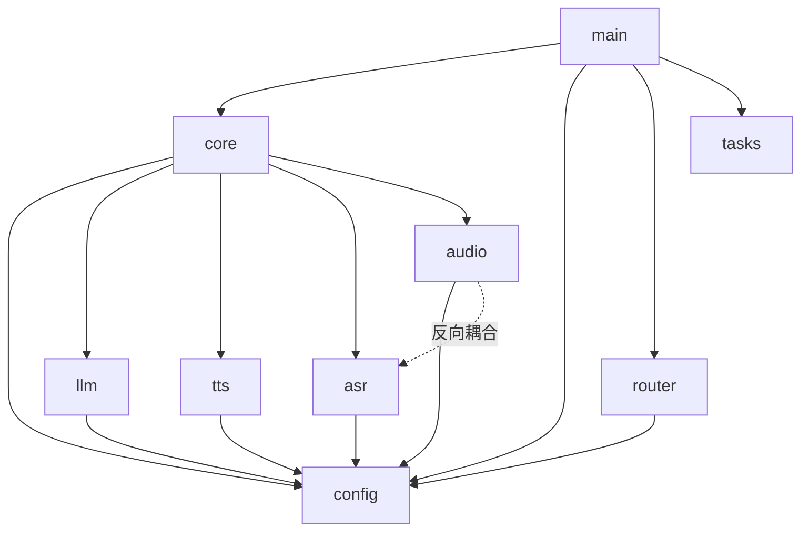

# Xiao（小二）项目深度审计报告

- **审计日期**：2026-08-29
- **审计模式**：Health Dashboard（架构 / 健壮性 / 技术债 / 测试 四维总览）+ DevSecOps 深度审计
- **审计范围**：backend 全部、frontend/src、desktop（Electron）、plugins/xiao-approval-bridge、tests、scripts
- **配套自检工具**：[scripts/verify_opensource.py](../../scripts/verify_opensource.py)（开源前自检，本次新增，0 失败 / 3 个预期警告）
- **综合评分**：**69 / 100**

| 维度 | 得分 | 一句话诊断 |
|---|---|---|
| 架构 Architecture | 84 | 分层清晰、零循环依赖，教科书级的引擎回退链 |
| 健壮性 / PR 质量 | 60 | 关键 I/O 路径大面积缺超时，一个卡死就瘫半边 |
| 技术债 | 66 | 默认值三处重复、fakes 复制粘贴，尚可控 |
| 测试 | 69 | 17 个语音链路文件 + 21 个端点零测试，T2 sleep 隐患 |

## 依赖关系总览



依赖图健康：无循环依赖，`config` 是唯一根；唯一污点是 `wake_omni -.-> asr/omni` 这条反向耦合。

> **勘误说明**：审计子代理曾声称「config.yaml:87 存真实 API key」——经逐行人工复核，**该说法不实**（L87 为 `apiKey: ''`），且 `verify_opensource.py` 全量扫描 0 密钥泄漏。当前密钥卫生合格；风险是条件性的（见 C2：一旦用户在设置页贴入 key，`GET /api/config` 会原样回显）。

---

## 1. 总体评价

骨架优秀、密钥纪律过硬，但安全红线的「最后一公里」在漏血：LLM 可以直接拉起任意进程、配置接口可被改写出提权，且全链路超时缺失意味着任何一个云引擎抖动就能让语音助手当场装死。

---

## 2. 严重问题清单（必须修改）

| # | 文件位置/行号 | 问题类型 | 具体危害 | 修复建议 |
|---|---|---|---|---|
| C1 | [open_app.py:39-43](../backend/tools/open_app.py#L39-L43) | 越权执行（LLM→进程） | 模型被提示注入后，`os.startfile(t)` / `Popen([t])` 可拉起**任意**可执行文件，聊天通道无审批门禁 | 白名单 + 审批钩子 |
| C2 | [main.py:168-190](../backend/main.py#L168-L190) + [config.py:40-84](../backend/config.py#L40-L84) | 任意配置写入 + 非原子保存 | `POST /api/config` 无白名单，可改写 `perms.standing_grants` 实现**持久化提权**；`save()` 断电留半截 YAML，下次启动解析失败即瘫 | 受保护段 + `os.replace` 原子写 |
| C3 | [main.py:40-80](../backend/main.py#L40-L80) | DNS Rebinding | 只查 `client.host`，不查 `Host` 头；恶意域名解析到 127.0.0.1 即绕过回环守卫，打穿整个本地 API | 增加 Host 头白名单 |
| C4 | [wake_omni.py:26-28](../backend/audio/wake_omni.py#L26-L28) + [omni.py:20,35](../backend/asr/omni.py#L20-L35) | 无超时阻塞 | 音频线程内同步 HTTP 无 timeout，omni 服务一挂，**唤醒/识别线程永久冻结** | 客户端级 `timeout=` |
| C5 | [edge_tts.py:92](../backend/tts/edge_tts.py#L92) + [omni.py:77-78](../backend/tts/omni.py#L77-L78) | 无超时 await | TTS 合成挂起 → `speak()` 永不返回 → 整条对话流水线堵死 | `asyncio.wait_for` 包裹 |
| C6 | [index.js:91-93](../plugins/xiao-approval-bridge/lib/index.js#L91-L93) | 预授权过宽 | 命令 bucket 兜底匹配所有命令 → 未经审批的指令全部放行，审批桥形同虚设 | 删除通配兜底，未知动词一律走审批 |

### 修复代码示例

**C1 — open_app.py 白名单 + 审批门禁：**

```python
APP_WHITELIST = {
    "notepad": ("notepad.exe",),
    "calc":    ("calc.exe",),
    "browser": ("msedge.exe", "chrome.exe", "firefox.exe"),
}
URL_RE = re.compile(r"^https?://[\w.-]+(:\d+)?(/[\w./?%&=-]*)?$")

async def _open(target: str) -> str:
    ok, _ = await approvals.request("open_app", target, timeout=30)  # 先过人审
    if not ok:
        return "用户拒绝该操作"
    t = target.strip().strip('"')
    if URL_RE.match(t):                      # URL 只放行 http(s)
        os.startfile(t); return f"已打开 {t}"
    exe = APP_WHITELIST.get(t.lower().split()[0])
    if not exe:                              # 应用名映射白名单，拒绝裸 Popen
        return f"未授权应用，仅允许：{', '.join(APP_WHITELIST)}"
    subprocess.Popen(exe, shell=False)
    return f"已启动 {exe[0]}"
```

**C2 — config.py 受保护段 + 原子写：**

```python
_PROTECTED = {"perms", "approval", "tools"}      # 权限段禁止经 API 修改

def update(self, updates: dict):
    for k in updates:
        if k in _PROTECTED:
            raise PermissionError(f"配置段 {k} 禁止通过 API 修改")
    self._deep_merge(self._data, updates)

def save(self):
    tmp = self.path.with_suffix(".yaml.tmp")
    with tmp.open("w", encoding="utf-8") as f:
        yaml.safe_dump(self._data, f, allow_unicode=True, sort_keys=False)
        f.flush(); os.fsync(f.fileno())
    os.replace(tmp, self.path)                   # 原子替换，断电无损
```

**C3 — loopback_guard 追加 Host 校验：**

```python
host = (request.headers.get("host") or "").split(":")[0].lower()
if host and host not in {"127.0.0.1", "localhost"}:
    return JSONResponse({"error": "invalid Host header"}, status_code=400)
```

**C4 — 音频线程客户端超时：**

```python
client = OpenAI(base_url=base, api_key=key, timeout=5.0, max_retries=1)
# 效果：omni 服务挂掉时 5 秒内抛错 → 走保底引擎，而不是唤醒线程永眠
```

**C5 — TTS 合成包超时：**

```python
audio = await asyncio.wait_for(self._synthesize(text), timeout=10.0)
# 超时 → 降级 edge-tts → 再超时 → Piper 本地，回退链才真正"回退"得起来
```

**C6 — 审批桥删除通配兜底：**

```javascript
const bucket = classify(cmd);
if (!bucket || !config.preApproved[bucket])   // 没有 bucket 就是没有授权
    return send("needs_approval", cmd);       // 未知动词一律走人审，宁严勿松
```

---

## 3. 优化建议清单（建议修改）

| # | 位置 | 问题 | 建议 |
|---|---|---|---|
| O1 | [main.py:163](../backend/main.py#L163) | WS 断连后 sender 残留集合，长期运行内存缓涨 | `finally` 中 `senders.discard(ws)` |
| O2 | [tasks.py:97-98](../backend/tasks.py#L97-L98) + [core.py:745-748](../backend/core.py#L745-L748) | TaskManager 跨线程读写无锁，任务计数可竞态 | `threading.Lock` 或统一经 `loop.call_soon_threadsafe` |
| O3 | cloud_paraformer 客户端 | dashscope 设置全局 api key，污染同进程其他 SDK | 用请求级凭据传参 |
| O4 | [qwen_realtime.py:256-260](../backend/tts/qwen_realtime.py#L256-L260) | 实例状态（connecting/ready）无互斥，重连可竞态 | `asyncio.Lock` 保护状态迁移 |
| O5 | [piper.py:52](../backend/tts/piper.py#L52) | mixer 按 22050 初始化但 piper 输出 24000，音调失真 | 采样率从 wav 头动态读取 |
| O6 | [cloud_paraformer.py:47-48](../backend/asr/cloud_paraformer.py#L47-L48) | `on_error: pass` 静默吞错，识别坏了无迹可寻 | 记 `logger.warning` 并回传占位结果 |
| O7 | [asr/factory.py:70-72](../backend/asr/factory.py#L70-L72) | 引擎初始化失败静默回退，用户不知道自己在用保底 | 回退时发一条 WS 通知 |
| O8 | [router.py:52-58](../backend/router.py#L52-L58) | 语音转写明文落盘，含隐私内容 | 确认 `logs/` 已 gitignore（已具备）+ 提供「不留存」开关 |
| O9 | [desktop/main.js:113-117,150](../desktop/main.js#L113-L117) | 端口被占用时信任抢占者（连上假后端） | 握手 token：后端启动生成，前端经参数携带校验 |
| O10 | plugins 桥 | 插件↔后端无共享凭证 | 本地 socket 加随机 token |
| O11 | desktop/package.json | Electron 31 已 EOL，收不到安全补丁 | 升至当前稳定大版本 |
| O12 | 测试 | 音频/asr/tts 17 个文件 + main.py 21 端点零测试；[test_tasks.py:87-88](../tests/test_tasks.py#L87-L88) 用 sleep 等异步（T2 脆睡）；fakes 目录多处复制粘贴；`_play_blocking` 模式重复 ×4；引擎默认值三处重复 | 优先补 open_app/config/perms 三条安全路径的测试；sleep 改事件驱动等待；fakes 抽公共包；默认值收敛到 config.yaml 单源 |

---

## 4. 亮点表扬

- **架构纪律**：零循环依赖、`config` 单根、云/本地/保底三层引擎回退链与 AGENTS.md 完全一致——很多商业项目都做不到。
- **进程安全基本功**：`subprocess` 全程 argv-list 不走 shell，注入面天然收窄；`os.startfile` 虽过宽但方向正确。
- **回环红线意识**：全部服务绑定 `127.0.0.1`，preview 路由带路径穿越正则防御——红线是清醒的，只是守卫实现要补 Host 校验。
- **前端零 XSS sink**：全量扫描未发现 `innerHTML` / `dangerouslySetInnerHTML` 直插用户数据。
- **工程质量**：[ws.ts](../frontend/src/ws.ts) 指数退避重连；离线测试套件可跑、fakes 质量高；审批逻辑「拒绝优先」设计正确。
- **密钥纪律**：config.yaml 全空 key + `.env.example` 引导 + `verify_opensource.py` 已把开源自检固化成一条命令。

---

## 修复优先级路线

1. **C2 + C6**（提权链，改动最小、收益最大）
2. **C1**（白名单，约半天工作量）
3. **C3 / C4 / C5**（各约 10 行）

修完这 6 项 Critical，综合分可从 69 拉到 80+，达到可放心交付给「第三使用者」（陌生环境、非开发机）的开箱即用标准（见 AGENTS.md 项目规则）。
